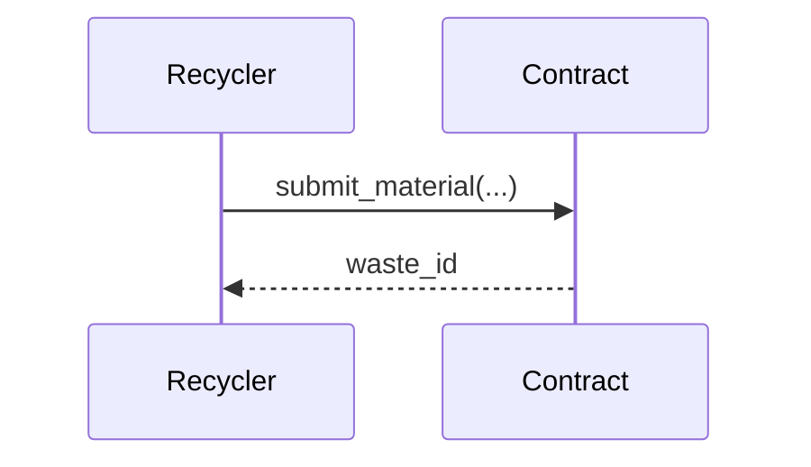

# Documentation Style Guide

This guide establishes writing and formatting standards for Scavngr documentation.

## Voice and Tone

- Write in **second person** ("you", "your") for guides and tutorials.
- Use **present tense** ("The function returns..." not "The function will return...").
- Be **concise** — avoid filler phrases like "It is important to note that..."
- Use **active voice** wherever possible.

## Markdown Conventions

### Headings

- Use sentence case: "Getting started with Soroban" not "Getting Started With Soroban".
- Do not skip heading levels (e.g., never go from `##` to `####`).
- The page title is the `title` frontmatter field — do not repeat it as an `#` heading.

### Code Blocks

Always include a language identifier:

````md
```rust
pub fn register_participant(env: Env, address: Address) { ... }
```
````

Supported identifiers: `rust`, `typescript`, `tsx`, `json`, `bash`, `toml`, `yaml`.

### Links

- Use **relative paths** for internal links: `[API Reference](/docs/api/overview)`.
- Use **descriptive text** — avoid "click here" or "this page".

### Admonitions

Use Docusaurus admonitions for callouts:

```md
:::info
This only applies to testnet deployments.
:::

:::warning
This action is irreversible on mainnet.
:::

:::tip
You can batch multiple waste submissions in a single transaction.
:::
```

## Frontmatter

Every page must include:

```yaml
---
id: my-page          # URL slug (lowercase, hyphens)
title: My Page Title # Page title (sentence case)
sidebar_position: 1  # Order within its sidebar category
---
```

## Diagrams

Prefer Mermaid diagrams embedded in MDX:

````md

````

## API Reference Format

Document each contract function with:

1. **Description** — one sentence.
2. **Parameters** — table with `Name`, `Type`, `Description`.
3. **Returns** — type and description.
4. **Errors** — list of possible error codes.
5. **Example** — code snippet showing a typical call.

## Versioning

Documentation versioning mirrors contract releases. When a breaking change is released:

1. Run `npm run docusaurus docs:version <version>` from the `website/` directory.
2. Update the `current` version label in `docusaurus.config.js`.
3. Archive the old version docs under `website/versioned_docs/`.
